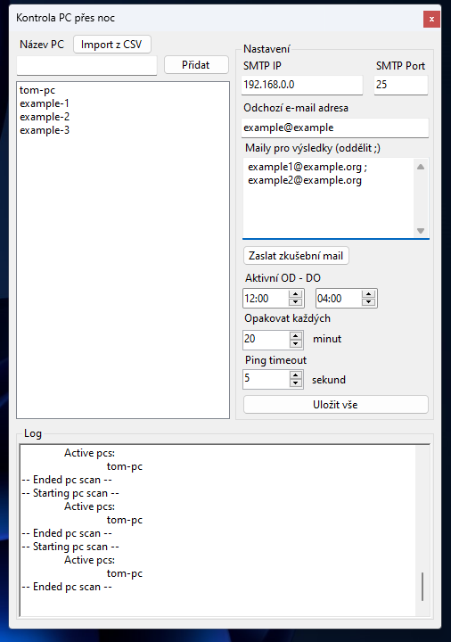

# What?

Program for checking active PCs on network periodically using DNS names or IP addresses. This program is supposed to be for IT admins. Czech labels only.

# Why?

Imagine you're an administrator. You want to know which computers are turned on during the night. This program is the solution for you.
You just set it up on some server, add IP(s) or domain names of PCs, SMTP server and you're done. Every night, PCs will get periodically pinged and you'll receive report about their status throughout the night to your mailbox in the morning.

# How to use?

For those of you who do not speak czech, I'm sorry :(, but this program has been developed with only czech translation in mind.
However, I will try my best to explain basic functionality/setup here.

First of all, the program runs automatically since you start it. Also, after you save your settings, you don't need to restart the program, it
will use the lastest saved configuration every time.

Here's a reference picture that you can look at while reading this description:



## How to add PCs?

There are several ways to add pcs. Firt one is to go into the box under `Název PC`, add IP or Domain name of the PC and click `Přidat` or press ENTER.
This approach should work well for small company, however for larger companies, there is a way to import all PCs. Just click the `Import z CSV` button
and select a CSV that looks like this:

```
PC_NAME1;
PC_NAME2;
PC_NAME3;
PC_NAME4;
PC_NAME5;
```

Valid CSV should contain names separated by new lines, since CSV regulary looks like the example given, program automatically removes
characters `;` and `,`

## How to remove a PC?

Just double click on the name you want to remove and in the pop-up dialog, select `Yes` or `Ano`.

## Settings

All available settings are under `Nastavení` box.

- I think you can guess what are `SMTP IP` and `SMTP Port` used for :D.
- `Odchozí e-mail adresa` is an email address used as a sender for reports.
- `Maily pro výsledky (oddělit ;)` are receiver emails for generated reports.
- `Zaslat zkušební mail` button is used to send test e-mail while configuring the program. This button will grab you (unsaved) configuration and try sending a test mail based on your (unsaved) settings. You should see the outcome of those test e-mails inside `Log` box.
- `Aktivní OD - DO` is a time period between which program tests for active PCs. Min is `00` Max is `24`. If you were to set it to run from `03:00` to `04:00`, it will assume that you mean same date. However, once FROM is higher than TO, meaning something like `from 20:00 to 04:00`, the program will assume that it need to run over night. Examples:
  - FROM => 20:00 ; TO => 03:00 --- program will run overnight (8 hours) between those hours and send you report around the ending time (03:00)
  - FROM => 18:00 ; TO => 21:00 --- program will **not** run overnight (3 hours) and send you report around the ending time (21:00)
- `Opakovat každých` is a setting which determines how many times in interval is the program supposed to try pinging active PCs. It works like `every`, so basically you say: I want this program to try pinging active PCs **every 20 minutes**. If you want this, then you set this box to 20.
- `Ping timeout` is a timeout for every single ping attempt, sometimes packets take their time, this option is really about experimentation. Usually pings get back in tens of miliseconds. The option is in seconds.

After you've set everything how you need it, just click `Uložit vše`.

And that's all! All you need to do right now, is wait and let the program run on some kind of windows server, or temporarily on some machine nobody uses :D

# Output

The program automatically sends emails when it finishes reports, however sometimes your SMTP server could be down, or you don't really want to
recieve reports to your email. If you're one of these cases, don't be woried, all reports are saved into: `C:\program_active_pcs_watchdog\reports`.
in the following format: `report-dd_MM_yyyy__HH_mm.txt`. Example report (saved and sent to email) are as follows:

```
Aktivní PC po celou dobu:
    tom-pc

Aktivní PC v 16.02.2023 19:02:
    example-1
    example-2
Aktivní PC v 16.02.2023 20:02:
    example-1
    example-2
Aktivní PC v 16.02.2023 21:02:
    example-2
```

`Aktivní PC po celou dobu` are PCs that were active for the whole duration of scanning.
`Aktivní PC v {DATE}` are those which were active in some point of scanning.

With this in mind, let's decypher our example report. The first thing we can notice is that `tom-pc` was enable for the whole duration of the scan.
The second we can see is that `example-1` was enabled at `19:02` and `20:02`, but it was turned off after that. Lastly, `example-2` was enabled at
`19:02`, `20:02` and `21:02`, after that it was turned off.

# Dev notes

- The proper implementation would have been to have a windows service (or Linux daemon) that does the actual scanning, and UI separated but it
  was easier/faster to implement UI and scanning logic into the same codebase and since the program needed to be developed ASAP, I decided to not
  separate UI and scaning service.
